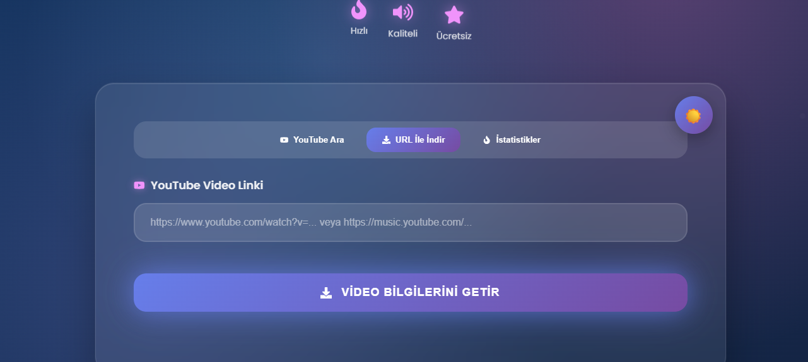
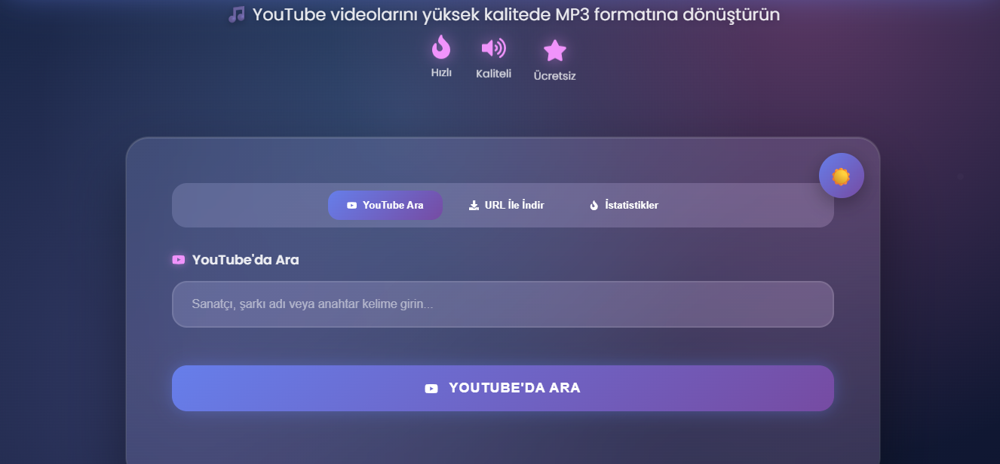
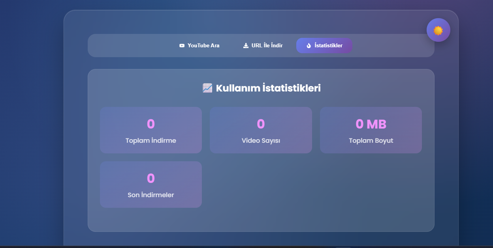

# YouTube MP3 İndirici 🎵

Modern ve kullanıcı dostu YouTube MP3 indirme web uygulaması.

## ✨ Özellikler

- 🔍 **YouTube Arama Motoru** - Link girmeden direkt arama
- 🌙 **Tema Değiştirici** - Light/Dark tema desteği  
- 📊 **Analitik Dashboard** - Kullanım istatistikleri
- 🎛️ **Ses Kalitesi Seçimi** - Farklı kalite seçenekleri
- ⚡ **Gerçek Zamanlı Progress** - İndirme yüzdesi ve hız göstergesi
- 🎨 **Modern UI/UX** - Glassmorphism ve gradient tasarım
- 📱 **Responsive Design** - Mobil uyumlu

## 🛠️ Teknolojiler

**Frontend:**
- React.js
- Styled Components  
- React Icons

**Backend:**
- Node.js
- Express.js
- @distube/ytdl-core

## 🚀 Kurulum

### Ön Gereksinimler
- Node.js (v16 veya üzeri)
- npm veya yarn

### Adımlar

1. **Projeyi klonlayın:**
```bash
git clone https://github.com/[kullanici-adi]/youtube-mp3-downloader.git
cd youtube-mp3-downloader
```

2. **Backend bağımlılıklarını yükleyin:**
```bash
npm install
```

3. **Frontend bağımlılıklarını yükleyin:**
```bash
cd client
npm install
cd ..
```

4. **Uygulamayı başlatın:**

**Backend için:**
```bash
node server/index.js
```

**Frontend için (yeni terminal):**
```bash
cd client
npm start
```

5. **Tarayıcınızda açın:**
```
http://localhost:3000
```

## 📱 Kullanım

1. **YouTube Ara** sekmesinde şarkı/sanatçı arayın
2. **URL İle İndir** sekmesinde direkt link girin  
3. **İstatistikler** sekmesinde kullanım verilerinizi görün
4. Ses kalitesini seçin ve indirin!

## 🎯 API Endpoints

- `POST /api/search` - YouTube arama
- `POST /api/video-info` - Video bilgilerini getir
- `POST /api/download` - MP3 indirme
- `GET /api/stats` - İstatistikler

## 📊 Özellikler Detay

### 🔍 YouTube Arama
- Anahtar kelime ile arama
- Sonuçları listeleme
- Tıklayarak seçme

### 🎛️ Ses Kalitesi
- En Yüksek Kalite (Otomatik)
- 128 kbps (Standart)
- 48 kbps (Düşük)

### 📈 İstatistikler
- Toplam indirme sayısı
- İndirilen dosya boyutu
- Son indirmeler listesi

## 🤝 Katkıda Bulunma

1. Fork'layın
2. Feature branch oluşturun (`git checkout -b feature/yeni-ozellik`)
3. Commit'leyin (`git commit -am 'Yeni özellik eklendi'`)
4. Push'layın (`git push origin feature/yeni-ozellik`)
5. Pull Request oluşturun

## ⚠️ Uyarı

Bu uygulama sadece eğitim amaçlıdır. YouTube'un hizmet şartlarına uygun olarak kullanın.

## 📝 Lisans

MIT License - Detaylar için `LICENSE` dosyasına bakın.

## 🔗 Bağlantılar

- [Demo](https://your-demo-link.com)
- [Issues](https://github.com/[kullanici-adi]/youtube-mp3-downloader/issues)
- [Discussions](https://github.com/[kullanici-adi]/youtube-mp3-downloader/discussions)

## 🎉 Ekran Görüntüleri





---

⭐ **Beğendiyseniz yıldız vermeyi unutmayın!**